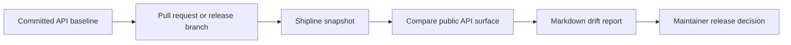

# Shipline

[](https://github.com/Hooptop/Shipline/actions/workflows/ci.yml)

Maintainer automation for catching breaking API changes, reviewing PR risk, and generating release-ready API drift reports.

Shipline is a CLI and GitHub Action workflow for open-source maintainers. It snapshots a package's public API, compares it during pull requests or releases, and writes a review-ready Markdown report with breaking changes, compatible additions, and suggested release impact.

It is built for the part of maintenance that usually happens late in the release cycle: a maintainer is reviewing a PR, checking the changelog, deciding whether the next version is patch, minor, or major, and trying not to miss a subtle exported API change. Shipline turns that review into a repeatable check.

## Why Maintainers Use It

Accidental API breaks are easy to miss in busy pull request queues. This tool gives maintainers a deterministic release check before they publish:

- catch removed exports
- catch changed public signatures
- identify compatible additions
- generate release-impact guidance
- create a maintainer checklist for reviews and changelogs

The core tool works without AI. API-backed features are planned for explanation, migration notes, changelog entries, and PR review comments.

Shipline's bias is to keep the release gate explainable. Static analysis produces the report; future AI features should help maintainers explain and act on that report, not replace it.

## Maintainer Workflow

1. Commit a baseline API snapshot before release.
2. Run Shipline in pull requests or release branches.
3. Review the generated API drift report.
4. Confirm intentional breaking changes and update migration notes before publishing.

See [Maintainer Workflows](./docs/MAINTAINER_WORKFLOWS.md) and the [Release Checklist](./docs/RELEASE_CHECKLIST.md) for the release and PR review flow.



## Quick Start

```bash
bun install
bun run build
bun run shipline snapshot --entry fixtures/before/package.json --out tmp/before.json
bun run shipline snapshot --entry fixtures/after-breaking/package.json --out tmp/after.json
bun run shipline compare --before tmp/before.json --after tmp/after.json --out tmp/report.md
```

## CLI

```bash
shipline snapshot --entry <package.json-or-entry-file> --out <api-snapshot.json>
shipline compare --before <api-snapshot.json> --after <api-snapshot.json> --out <api-drift-report.md>
shipline check --baseline <api-snapshot.json> --entry <package.json-or-entry-file> --fail-on breaking
```

### `snapshot`

Creates a JSON snapshot of public exports.

```bash
shipline snapshot --entry package.json --out api-snapshot.json
```

### `compare`

Compares two snapshots and writes a Markdown report.

```bash
shipline compare --before api-snapshot.old.json --after api-snapshot.json --out api-drift-report.md
```

### `check`

Creates a fresh snapshot, compares it to a committed baseline, and optionally fails on breaking changes.

```bash
shipline check --baseline api-snapshot.json --entry package.json --out api-drift-report.md --fail-on breaking
```

## Sample Report

```markdown
# API Drift Report

Shipline found 4 breaking public API changes. Suggested release impact: **major**.

- Before: `fixture-library@1.0.0`
- After: `fixture-library@2.0.0`
- Breaking changes: 4
- Compatible additions: 0
- Informational changes: 0

## Maintainer Checklist

- [ ] Confirm each breaking change is intentional.
- [ ] Add or update migration notes.
- [ ] Update changelog with a major-version entry.
- [ ] Check README and docs examples for old API usage.
- [ ] Consider downstream smoke tests before release.
```

## GitHub Actions

Commit a baseline snapshot, then run this check in pull requests.

```yaml
name: API Drift

on:
  pull_request:

permissions:
  contents: read

jobs:
  api-drift:
    runs-on: ubuntu-latest
    steps:
      - uses: actions/checkout@v4
      - uses: oven-sh/setup-bun@v2
      - run: bun install --frozen-lockfile
      - run: bun run build
      - run: bun run shipline check --baseline api-snapshot.json --entry package.json --out api-drift-report.md --fail-on breaking
      - uses: actions/upload-artifact@v4
        if: always()
        with:
          name: api-drift-report
          path: api-drift-report.md
```

## Supported Export Patterns

Version `0.1.0` supports common TypeScript library exports:

- `export function`
- `export class`
- `export interface`
- `export type`
- `export const`
- `export { name } from "./module"`
- `export * from "./module"` where practical
- package `exports`, `main`, `types`, and `typings` entry discovery

## Known Limitations

- Dynamic exports are not supported.
- Complex conditional package exports are best-effort.
- Signature comparison is conservative and may flag formatting-significant changes.
- The first release targets JS/TS libraries, not every npm package shape.

## Planned API-Credit Usage

The deterministic core intentionally works without AI. API credits would add maintainer workflow features:

- explain API diffs in plain English
- draft PR review comments
- generate migration notes
- suggest changelog entries
- summarize downstream compatibility risk
- convert raw reports into release guidance for contributors and users

## Roadmap Starters

The first maintainer roadmap issues are captured in [Starter Issues](./docs/STARTER_ISSUES.md) for PR commenting, migration-note drafts, and monorepo package baselines.

## Development

```bash
bun install
bun run verify
```

## Security

This tool is designed for repository automation and may process pull request source files. Keep GitHub token permissions minimal, avoid running generated code, and treat forked PR content as untrusted. See [SECURITY.md](./SECURITY.md) and [Security Model](./docs/SECURITY_MODEL.md).

## License

MIT
